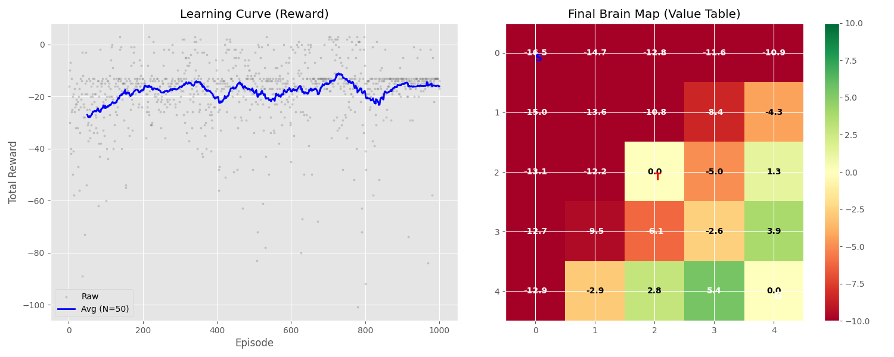

# 🧪 Monte Carlo Slime (몬테카를로 슬라임)

> **"A dumb pixel trying to get smart using Monte Carlo methods."**
> (몬테카를로 법칙으로 똑똑해지려고 노력하는 멍청한 픽셀의 이야기)


## 📖 Introduction (소개)
이 프로젝트는 **강화학습(Reinforcement Learning)**의 가장 기초적인 이론인 **몬테카를로(Monte Carlo)** 방법을 공부하기 위해 만들어졌습니다.

복잡한 딥러닝 프레임워크(PyTorch, TensorFlow)를 사용하지 않고, **순수 Python (`numpy`, `random`)** 만을 사용하여 슬라임(Agent)이 스스로 길을 찾는 과정을 시뮬레이션합니다.

이 프로젝트는 **[Vibe Coding]** 방식으로 진행됩니다:
1. 자연어로 법칙을 먼저 정의하고 (`rules.md`)
2. AI와 협력하여 코드를 구현하며
3. 천천히, 즐겁게 코딩합니다. 🐢

## 🚀 How to Run (실행 방법)
*(코드가 완성되면 아래 명령어로 실행할 수 있습니다)*

```bash
# 레포지토리 클론
git clone https://github.com/dodookmung/monte-carlo-slime.git

# 디렉토리 이동
cd monte-carlo-slime

# 시뮬레이션 시작!
uv run python main.py
```

## 🎮 The Rules (법칙)
상세한 시뮬레이션 규칙은 [📜 rules.md](./rules.md) 문서에 정의되어 있습니다.

* **World:** 5x5 격자 세상
* **Agent:** 🟩 배고픈 슬라임
* **Goal:** 🍎 사과 (+10점)
* **Trap:** 🕳 구덩이 (-10점)
* **Cost:** 한 칸 움직일 때마다 체력 소모 (-1점)

슬라임은 처음에는 술 취한 것처럼 랜덤하게 걷지만, 수많은 죽음과 성공을 반복하며 점점 **'최적의 경로'**를 학습하게 됩니다.

## 📊 Training Results (훈련 결과)
1,000번의 에피소드를 시뮬레이션한 결과입니다.



### 1. Learning Curve (왼쪽 그래프)
* 학습 초반에는 무작위 탐험으로 인해 점수가 매우 낮고 불안정합니다.
* 200~300 에피소드 이후, 슬라임이 사과를 찾는 법을 터득하면서 점수가 급격히 상승합니다. (우상향)
* 후반부에는 안정적이고 높은 점수를 유지합니다.

### 2. Final Brain Map (오른쪽 히트맵)
* **초록색 영역:** 슬라임이 "좋은 땅"이라고 생각하는 곳입니다. 사과(G) 주변이 초록색으로 빛나고 있습니다.
* **빨간색 영역:** 함정(T)이나 스타트 지점처럼 멀리 떨어진 곳은 가치가 낮게(붉게) 형성되었습니다.
* 슬라임은 이 '가치 지도'를 보고 높은 숫자가 적힌 방향으로 이동하여 사과를 찾아갑니다.

### 3. Meaning of the Numbers (숫자의 의미: 상태 가치)
지도에 적힌 숫자는 **상태 가치 (State Value, $V(s)$)**를 의미합니다.

> **"이 자리에 서 있으면, 앞으로 평균적으로 얼마를 벌 수 있을까?"**

* 슬라임은 수천 번의 삶(Episode)을 반복하며, "이 자리에서 출발했더니 결국 평균적으로 몇 점을 벌더라?"를 학습합니다.
* **높은 숫자 (초록색)**: 사과에 가깝고 유리한 위치 (명당)
* **낮은 숫자 (붉은색)**: 사과와 멀거나 함정에 가까운 위험한 위치 (흉지)
* 즉, 슬라임은 단순히 눈앞의 이익이 아니라, **미래에 얻을 보상까지 예측**하여 움직입니다.

